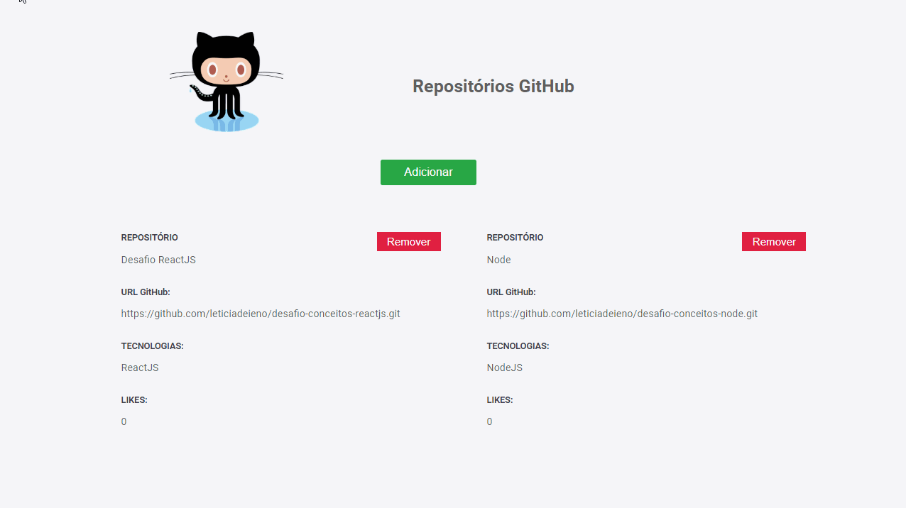

<h1 align="center">
    
</h1>

<h1>
    
</h1>

# Índice

- [Sobre](#-sobre)
- [Teconologias Utilizadas](#-tecnologias-utilizadas)
- [Como Baixar o Projeto](#-como-baixar-o-projeto)

---

## 📝 Sobre

Resultado do **Desafio Conceitos ReactJS**, do **Bootcamp GoStack**, esse projeto consiste em cadastrar, remover e listar os repositórios cadastrados anteriormente. 

---

## 🚀 Tecnologias Utilizadas

O projeto foi desenvolvido utilizando as seguintes tecnologias: 

- [ReactJS](https://pt-br.reactjs.org/)
- [Axios](https://github.com/axios/axios)

---

## 👨‍💻 Como Baixar o Projeto

```bash
# clonar projeto
$ git clone https://github.com/leticiadeieno/desafio-conceitos-reactjs.git

# acessar a pasta desafio-conceitos-reactjs
$ cd desafio-conceitos-reactjs

# instalar todas as dependências
$ yarn install 

# iniciar aplicação
$ yarn start
```

---

🙋‍♀️ Desenvolvido por: Leticia Deieno Tadeu